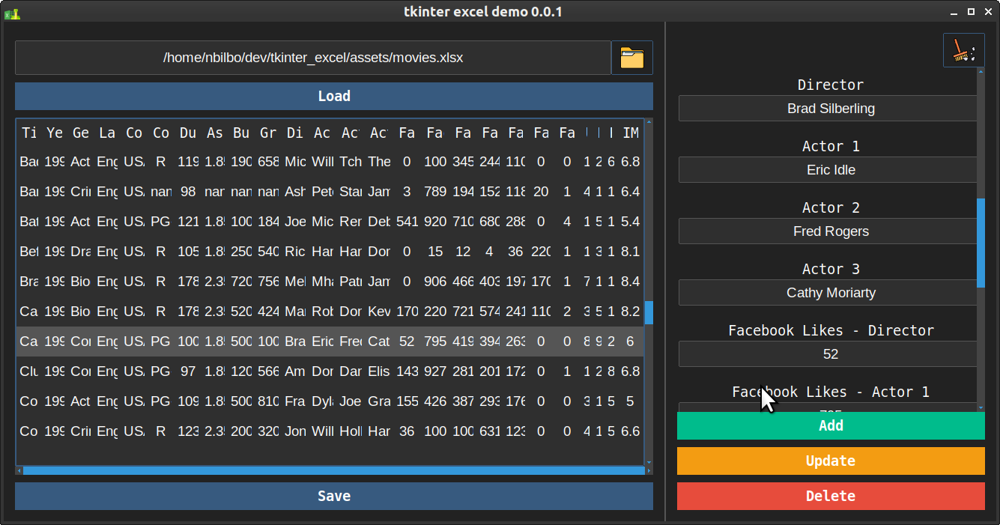
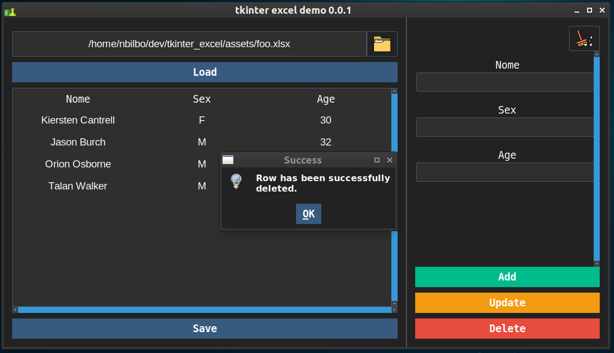

# tkinter and excel

## how run?

- first, install the requirements

    `python3 -m pip install -r requirements.txt`

- run the application

    `python3 main.py`

## screenshots

## Purposes
- Read and edit excel files.

## bugs

- Currently all new and edited values are saved in string format.

- Currently only are possible to save in .xlsx format.

## TODO
- [ ] Show all sheets, current only load the first.
- [ ] new and edit values must be converted to original column type.
